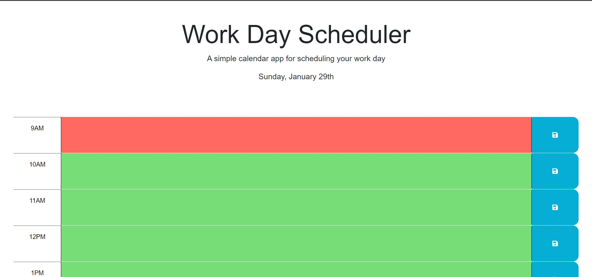

# Organized Chaos
## Description

My motivation for this project was to implement the things we learned during the week and previous weeks to complete this interactive daily planner.  Doing this project help me have a better understaning of jquery and dayjs.

## Installation

N/A

## Usage
https://xkranze.github.io/organized-chaos/
 

## Credits
Starter code from: https://github.com/coding-boot-camp/crispy-octo-meme

https://stackoverflow.com/ 

addtional tutoring
## License
N/A
